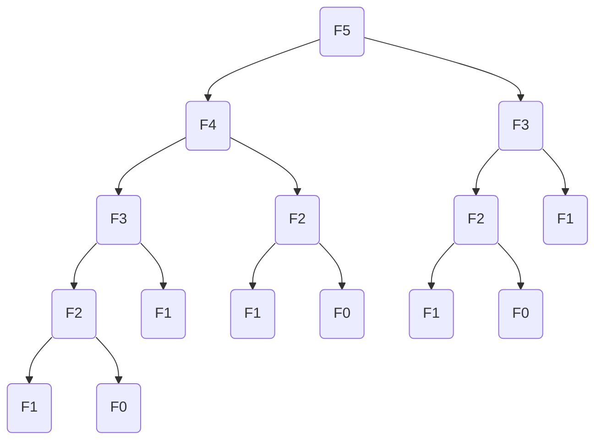
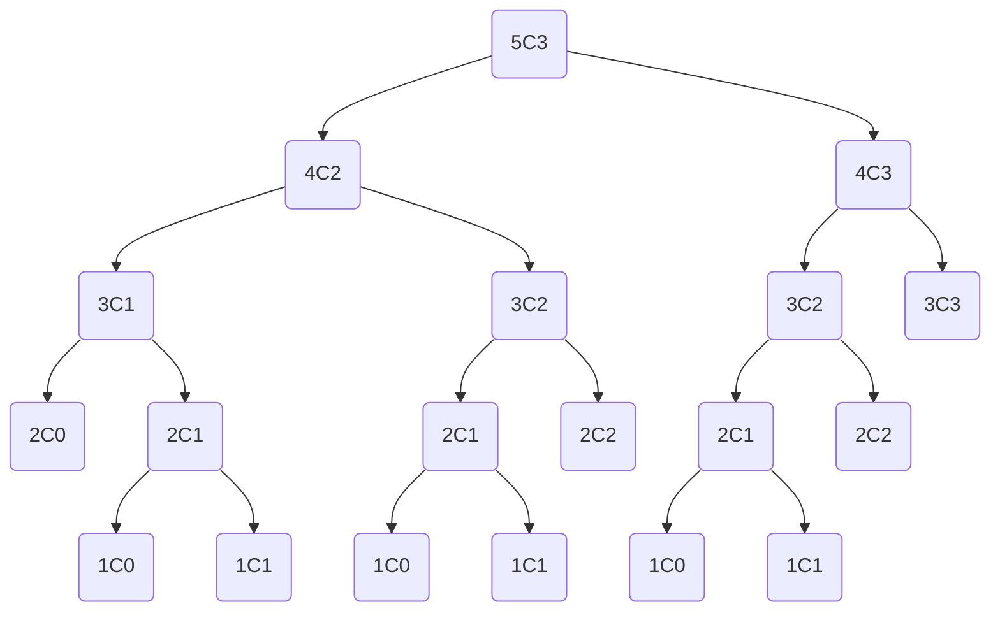

# Dynamic Programming

## Fibonacci
The Fibonacci number $F_n$ can be calculated using 
the following formula where $F_0=0$ and $F_1=1$.
```math
F_n = F_{n-1} + F_{n-2}
```
This can be directly translated into the following C code using recursion:
```C
int fibonacci(const int n) {
	if (n == 0 || n == 1) {
		return n;
	}
	return fibonacci(n - 1) + fibonacci(n - 2);
}
```
The code is easily comprehensible, but the runtime of it is rather poor.

The above graph demonstrates that the function call `fibonacci(5)` 
already involves a lot of redundant calculations, such as `fibonacci(3)` and 
`fibonacci(2)`. At this point we should take a step back. Lets reiterate 
what we already know. In order to calculate $F_{n+2}$ we need $F_{n+1}$ and 
$F_n$. A better approach than calculating $F_n$ using $F_{n-1}$ and $F_{n-2}$
would be to calculate it from the smallest piece we know, i.e. $F_0$ and 
$F_1$ and then $F_2$. The concept could be visualized as follows:

| $n$   | $0$ | $1$ | $2$     | $3$       | $4$     | $5$     |
|-------|-----|-----|---------|-----------|---------|---------|
| $F_n$ | $0$ | $1$ | $0+1=1$ | $1+1=2$   | $1+2=3$ | $2+3=5$ |

This way we don't need to calculate a subproblem multiple times. 
The code for a primitive calculation storing all calculated values 
could like as follows.
```C
int fibonacci_array(const int n) {
	int array[n];
	array[0] = 0;
	array[1] = 1;

	for (int i = 2; i <= n; i++) {
		array[i] = array[i - 1] + array[i - 2];
	}
	return array[n];
}
```
At this point there is one more optimization that could me made regarding
its memory usage. In order to calculate $F_n$ we only need to store $F_{n-1}$
and $F_{n-2}$. So we do not to store the whole sequence of fibonacci numbers
inside of an array. So the final form would like this:
```C
int dynamic_fibonacci(const int n) {
	int x = 0;
	int y = 1;
	for (int i = 0; i < n; i++) {
		const int t = y;
		y += x;
		x = t;
	}
	return x;
}
```

## Binomial Coefficients
Binomial Coeeficients can be calculated using the following formula,
where $\binom{n}{0}=1$ and $\binom{n}{n}=1$.
```math
\binom{n}{k} = \binom{n-1}{k-1} + \binom{n-1}{k}
```

The naive approach would be using recursion:
```C
int binomial(const int n, const int k) {
	if (n == k || k == 0) {
		return 1;
	}
	return binomial(n - 1, k - 1) + binomial(n - 1, k);
}
```

The above recursive code can again be visualized using a graph.


Applying the learnings from above we can calculate the binomial coefficients
using a matrix:

| **$n \textbackslash k$** | $0$ | $1$ | $2$  | $3$  |
|:------------------------:|-----|-----|------|------|
| $0$                      | $1$ |     |      |      |
| $1$                      | $1$ | $1$ |      |      |
| $2$                      | $1$ | $2$ | $1$  |      |
| $3$                      | $1$ | $3$ | $3$  | $1$  |
| $4$                      | $1$ | $4$ | $6$  | $4$  |
| $5$                      | $1$ | $5$ | $10$ | $10$ |

The code for populating the matrix would look as follows.
```C
int binomial_matrix(const int n, const int k) {
	int matrix[n + 1][k + 1];

	for (int i = 0; i <= n; i++) {
		for (int j = 0; j <= k; j++) {
			if (i == j || j == 0) {
				matrix[i][j] = 1;
			} else {
				matrix[i][j] = matrix[i - 1][j - 1] + matrix[i - 1][j];
			}
		}
	}

	return matrix[n][k];
}
```
Now there is one more thing to consider. In order to calculate a row
$R_x$ with $x > 0$ we only need $R_{x-1}$. So in total
we only need one row $R_x$ to store the current values and one row
$R_{x-1}$ to access the previously calculated values.
```C
int dynamic_binomial(const int n, const int k) {
	int array_1[k + 1];
	int array_2[k + 1];

	int *current = array_1;
	int *previous = array_2;
	for (int i = 0; i <= n; i++) {
		current = (current == array_1) ? array_2 : array_1;
		previous = (previous == array_1) ? array_2 : array_1;

		for (int j = 0; j <= i; j++) {
			if (i == j || j == 0) {
				current[j] = 1;
			} else {
				current[j] = previous[j - 1] + previous[j];
			}
		}
	}

	return current[k];
}
```

## Trinomial Coefficients
The trinomial coefficients can be calculated using the below function with 
$\binom{n}{k}_2=1$ if $|k|=n$ and $\binom{n}{k}_2=0$ if $|k|>n$.
```math
\binom{n}{k}_2 = \binom{n-1}{k-1}_2 + \binom{n-1}{k}_2 + \binom{n-1}{k+1}_2
```

Again the recursive code can be easily obtained from the mathematical formula.
```C
int trinomial(const int n, const int k) {
	if (abs(k) == n) {
		return 1;
	} else if (abs(k) > n) {
		return 0;
	}
	return trinomial(n - 1, k - 1) + trinomial(n - 1, k) +
				 trinomial(n - 1, k + 1);
}
```

This time we are going to skip the graph and we are looking straight
onto the matrix calculating the values. The matrix can be easily filled
by going row by row and column by column over it and applying the
aforementioned rules.

| $n\textbackslash k$ | $-3$ | $-2$ | $-1$ | $0$ | $1$ | $2$ | $3$ |
|---------------------|------|------|------|-----|-----|-----|-----|
|  $0$                | $0$  | $0$  | $0$  | $1$ | $0$ | $0$ | $0$ |
|  $1$                | $0$  | $0$  | $1$  | $1$ | $1$ | $0$ | $0$ |
|  $2$                | $0$  | $1$  | $2$  | $3$ | $2$ | $1$ | $0$ |
|  $3$                | $1$  | $3$  | $6$  | $7$ | $6$ | $3$ | $1$ |

Effectively you only need this half of the matrix:
| $n\textbackslash k$ | $0$ | $1$ | $2$ | $3$ |
|---------------------|-----|-----|-----|-----|
|  $0$                | $1$ | $0$ | $0$ | $0$ |
|  $1$                | $1$ | $1$ | $0$ | $0$ |
|  $2$                | $3$ | $2$ | $1$ | $0$ |
|  $3$                | $7$ | $6$ | $3$ | $1$ |

An example of how that could be done using code is shown below.
```C
int trinomial_matrix(const int n, const int k) {
	int matrix[n + 1][n + 1];

	for (int i = 0; i <= n; i++) {
		for (int j = 0; j <= n; j++) {
			if (i == j) {
				matrix[i][j] = 1;
			} else if (j > i) {
				matrix[i][j] = 0;
			} else {
				matrix[i][j] =
						matrix[i - 1][abs(j - 1)] + matrix[i - 1][j] + matrix[i - 1][j + 1];
			}
		}
	}

	return matrix[n][k];
}
```

The same memory optimizations from above can be applied here as well:
```C
int dynamic_trinomial(const int n, const int k) {
	int array_1[n + 1];
	int array_2[n + 1];

	int *current = array_1;
	int *previous = array_2;
	for (int i = 0; i <= n; i++) {
		current = (current == array_1) ? array_2 : array_1;
		previous = (previous == array_1) ? array_2 : array_1;

		for (int j = 0; j <= n; j++) {
			if (i == j) {
				current[j] = 1;
			} else if (j > i) {
				current[j] = 0;
			} else {
				current[j] = previous[abs(j - 1)] + previous[j] + previous[j + 1];
			}
		}
	}

	return current[k];
}
```

## Longest Common Subsequence
Given two sequences $X=(x_1,...x_m)$ and $Y=(y_1,...,y_n)$, the
length of their longest common subsequence can be calculated using
the following formula.
```math
c[i,j]=
\begin{cases}
0,                       &\text{if $i=0$ or $j=0$}\\
c[i-1,j-1]+1,            &\text{if $i,j>0$ and $x_i=y_j$}\\
max(c[i-1,j], c[i,j-1]), &\text{if $i,j>0$ and $x_i\neq y_j$}
\end{cases}
```

Using the above formula we can successively populate a matrix.
| $c[i-1,j-1]$ | $c[i-1,j]$ |
|--------------|------------|
| $c[i,j-1]$   | $c[i,j]$   |

The code for calculating the length of the LCS could look something like this.
```C
int dynamic_lcslen(const char x[], const char y[]) {
	const int m = strlen(x);
	const int n = strlen(y);

	int c[m + 1][n + 1];

	for (int i = 0; i <= m; i++) {
		c[i][0] = 0;
	}

	for (int j = 0; j <= n; j++) {
		c[0][j] = 0;
	}

	for (int i = 1; i <= m; i++) {
		for (int j = 1; j <= n; j++) {
			if (x[i - 1] == y[j - 1]) {
				c[i][j] = c[i - 1][j - 1] + 1;
			} else if (c[i - 1][j] >= c[i][j - 1]) {
				c[i][j] = c[i - 1][j];
			} else {
				c[i][j] = c[i][j - 1];
			}
		}
	}

	return c[m][n];
}
```
