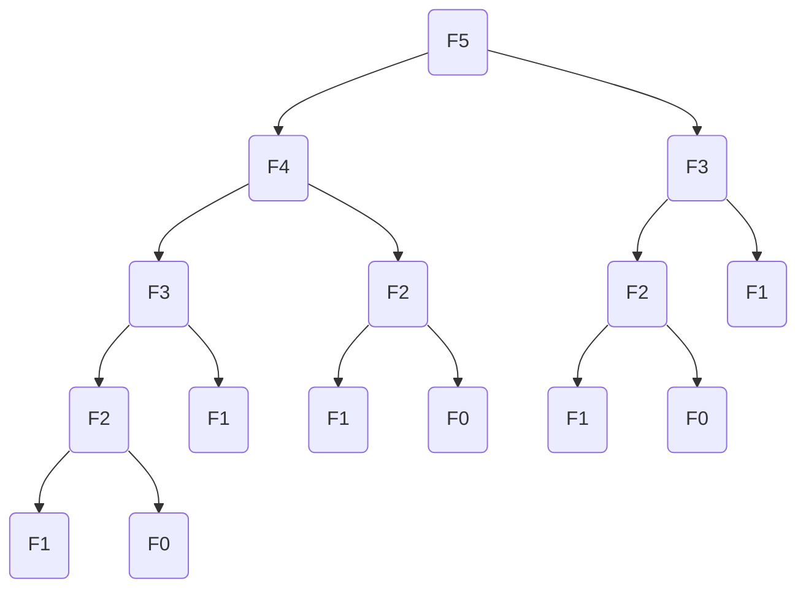

# Dynamic Programming

## Chapters
- Fibonacci
- Binomial Coefficients
- Trinomial Coefficients

## Fibonacci
The Fibonacci number $F_n$ can be calculated using the following formula where $F_0=0$ and $F_1=1$.
```math
F_n = F_{n-1} + F_{n-2}
```
This can be directly translated into the following C code using recursion:
```C
int fibonacci(const int n) {
  if (n == 0 || n == 1) {
    return n;
  }
  return fibonacci(n - 1) + fibonacci(n - 2);
}
```
The code is easily comprehensible, but the runtime of it is rather poor.

The above graph demonstrates that the function call `fibonacci(5)` already involves a
lot of redundant calculations, such as `fibonacci(3)` and `fibonacci(2)`. The obvious
approach would be to store the already calculated values inside of a data structure, but
there is a more memory efficient way.

WIP

## Binomial Coefficients
WIP
```math
\binom{n}{k} = \binom{n-1}{k-1} + \binom{n-1}{k}
```

## Trinomial Coefficients
WIP
```math
\binom{n}{k}_2 = \binom{n-1}{k-1}_2 + \binom{n-1}{k}_2 + \binom{n-1}{k+1}_2
```
