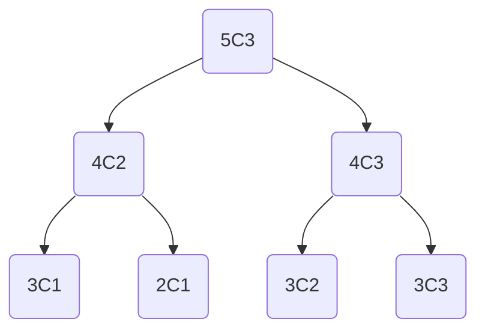

# Dynamic Programming

## Chapters
- Fibonacci
- Binomial Coefficients
- Trinomial Coefficients

## Fibonacci
The Fibonacci number $F_n$ can be calculated using 
the following formula where $F_0=0$ and $F_1=1$.
```math
F_n = F_{n-1} + F_{n-2}
```
This can be directly translated into the following C code using recursion:
```C
int fibonacci(const int n) {
  if (n == 0 || n == 1) {
    return n;
  }
  return fibonacci(n - 1) + fibonacci(n - 2);
}
```
The code is easily comprehensible, but the runtime of it is rather poor.

The above graph demonstrates that the function call `fibonacci(5)` 
already involves a lot of redundant calculations, such as `fibonacci(3)` and 
`fibonacci(2)`. At this point we should take a step back. Lets reiterate 
what we already know. In order to calculate $F_{n+2}$ we need $F_{n+1}$ and 
$F_n$. A better approach than calculating $F_n$ using $F_{n-1}$ and $F_{n-2}$
would be to calculate it from the smallest piece we know, i.e. $F_0$ and 
$F_1$ and then $F_2$. The concept could be visualized as follows:

| **Index**  | $0$ | $1$ | $2$     | $3$       | $4$     | $5$     |
|------------|-----|-----|---------|-----------|---------|---------|
| **Result** | 0   | 1   | $0+1=1$ | $1+1=2$   | $1+2=3$ | $2+3=5$ |

This way we don't need to calculate a subproblem multiple times. 
The code for a primitive calculation storing all calculated values 
could like as follows.
```C
int fibonacci_array(const int n) {
  int array[n];
  array[0] = 0;
  array[1] = 1;

  for (int i = 2; i <= n; i++) {
    array[i] = array[i - 1] + array[i - 2];
  }
  return array[n];
}
```
At this point there is one more optimization that could me made regarding
its memory usage. In order to calculate $F_n$ we only need to store $F_{n-1}$
and $F_{n-2}$. So we do not to store the whole sequence of fibonacci numbers
inside of an array. So the final form would like this:
```C
int dynamic_fibonacci(const int n) {
  int x = 0;
  int y = 1;
  for (int i = 0; i < n; i++) {
    const int t = y;
    y += x;
    x = t;
  }
  return x;
}
```

## Binomial Coefficients
Binomial Coeeficients can be calculated using the following formula,
where $\binom{n}{0}=1$ and $\binom{n}{n}=1$.
```math
\binom{n}{k} = \binom{n-1}{k-1} + \binom{n-1}{k}
```

The naive approach would be using recursion:
```C
int binomial(const int n, const int k) {
  if (n == k || k == 0) {
    return 1;
  }
  return binomial(n - 1, k - 1) + binomial(n - 1, k);
}
```



Applying the learnings from above we can calculate the binomial coefficients
using a matrix:
| $0$ | $1$ | $2$ | $3$ | **$k / n$** |
|-----|-----|-----|-----|:-----------:|
| $1$ |     |     |     |     $0$     |
| $1$ | $1$ |     |     |     $1$     |
| $1$ | $2$ | $1$ |     |     $2$     |
| $1$ | $3$ | $3$ | $1$ |     $3$     |

The code for populating the matrix would look as follows.
```C
int dynamic_binomial(const int n, const int k) {
  int matrix[n][k + 1];

  for (int i = 0; i < n; i++) {
    for (int j = 0; j <= k; j++) {
      if (i == j || j == 0) {
        matrix[i][j] = 1;
      } else {
        matrix[i][j] = matrix[i - 1][j - 1] + matrix[i - 1][j];
      }
    }
  }

  return matrix[n - 1][k - 1] + matrix[n - 1][k];
}
```

## Trinomial Coefficients
WIP
```math
\binom{n}{k}_2 = \binom{n-1}{k-1}_2 + \binom{n-1}{k}_2 + \binom{n-1}{k+1}_2
```
